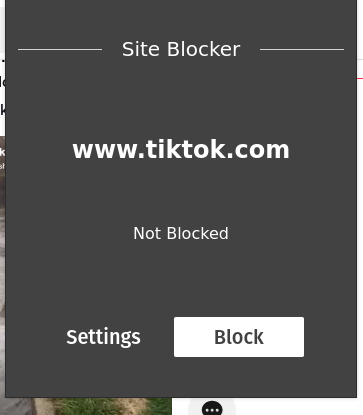
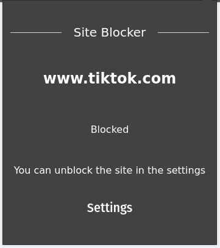
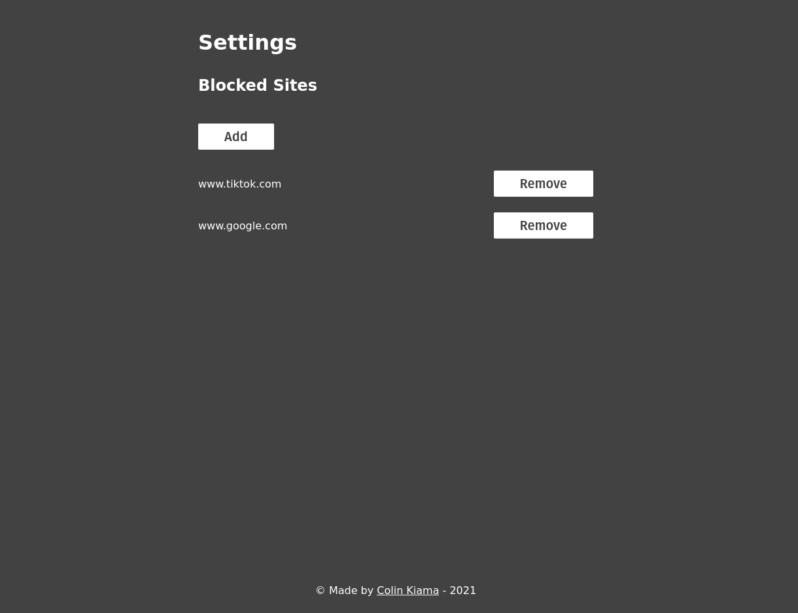

# Site Blocker

**Update**: Project is now archived. New version is in: https://www.gitlab.com/colinkiama/jailtime

Extension that blocks sites

Get it here!: https://addons.mozilla.org/en-GB/firefox/addon/full-stop/







## Prequisites

-   Node v14.14.0 (Lowest version tested on)
-   NPM Version v6.14.8

## Install instructions

At first launch, run:

```sh
npm install
```

## Main Build Scripts

| Command              | Description                                                                |
| -------------------- | -------------------------------------------------------------------------- |
| `npm run start`      | Runs a snowpack dev server in the /src directory                           |
| `npm run build`      | Builds the extension, ready so that it's ready to be tested with web-ext   |
| `npm run build:prod` | Performs `npm run build` then packages the extension with `web-ext build`. |
| `npm run dev`        | Performs `npm run build` then runs a a `web-ext` dev server.               |


## Production Build
`npm run build:prod` is the production build.
